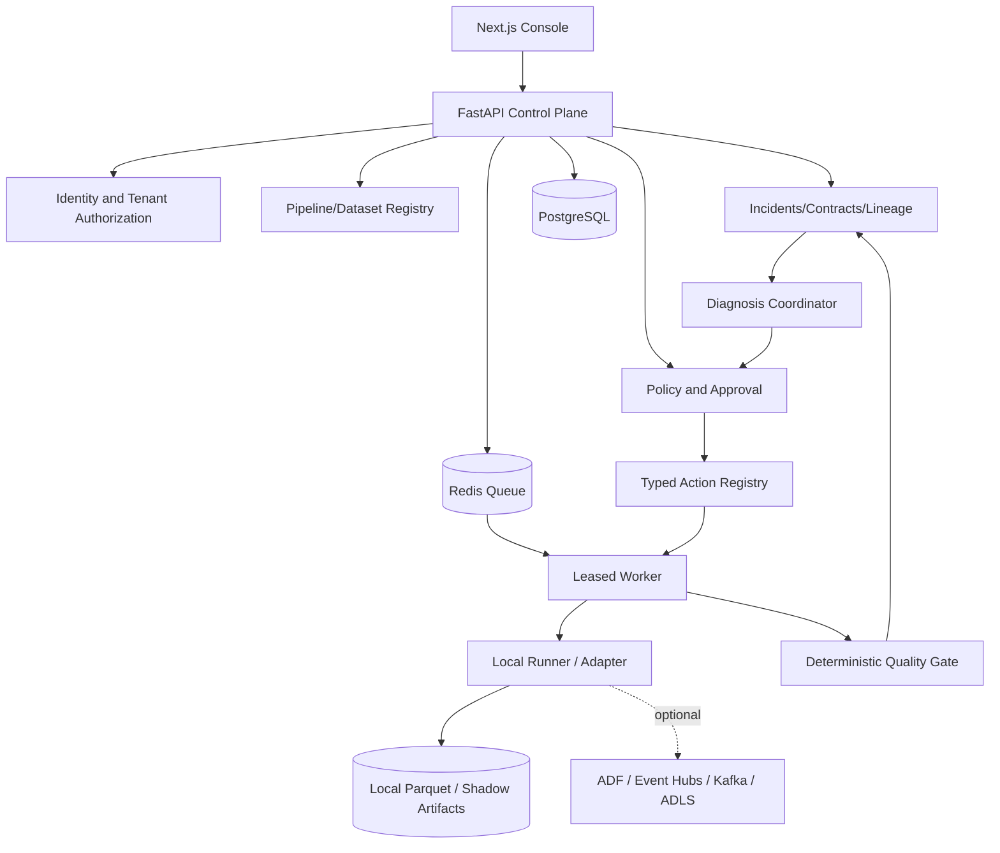

# Architecture, component boundaries and repository layout

## Decision
**Modular monolith with a distinct worker process**. This prevents unnecessary distributed coordination while retaining domain boundaries. All important facts persist in PostgreSQL; Redis is transport/cache, not sole audit or incident storage.



## Proposed repository layout *after implementation*

```text
takshyra/
├── README.md, AGENTS.md, CODEX_MASTER_PROMPT.md, CODEX_START_HERE.md
├── apps/
│   ├── api/                  # FastAPI routes, auth wiring, DI
│   └── web/                  # Next.js pages/components
├── packages/
│   ├── domain/               # entities, enums, repository interfaces
│   ├── quality/              # contract evaluator and quality checks
│   ├── lineage/              # OpenLineage parser and graph service
│   ├── incidents/            # incident creation and correlation
│   ├── policies/             # immutable action registry + decision rules
│   ├── agents/               # structured diagnosis/proposal providers
│   ├── connectors/           # local; azure; streaming adapters
│   └── observability/        # OTel and log helpers
├── services/worker/          # retries, leases, run attempts, safe executors
├── migrations/               # Alembic
├── seed/                     # deterministic fixtures
├── examples/                 # demo contracts, example events, fault cases
├── tests/                    # unit/integration/e2e/security/fault/perf
├── scripts/                  # setup, seed, benchmark, demos
├── infra/                    # docker, optional sandbox Terraform (plan only)
├── prompts/                  # Codex milestone instructions
├── docs/, decisions/         # specs, ADRs, runbooks
├── .github/workflows/        # real CI checks
├── .env.example, .gitignore, docker-compose.yml, pyproject.toml
└── Makefile
```

**Current M1 implementation:** `takshyra/` is the modular Python app and worker, with `migrations/` and `compose.yaml`. The `apps/` and `packages/` tree above remains a long-term logical destination. See `IMPLEMENTATION_STATUS.md` for verified behavior and outstanding gates.

## Architecture invariants
1. Browser is untrusted. Backend determines identity and verifies object/tenant permissions.
2. Worker messages are untrusted. Load entity by secure identifier; validate stored context again; guard lease/transition.
3. Model output is untrusted. Never passes directly to action handlers.
4. Every mutating action goes through the action service; no hidden direct adapter write path.
5. Artifacts use tenant-aware keys, scoped access, retention and checksums.
6. Incidents/diagnoses cannot elevate privileges.
7. Publish artifact manifests atomically where possible after quality gate; acknowledge unavoidable filesystem/object storage limitations.
8. Queue retry is at least once: dual deliveries must not double-publish or duplicate recovery side effects.

## Example domain flow
User trigger → authorize → idempotent PipelineRun QUEUED → DB task record / transactional outbox (if implemented) → worker claim with lease → transform to stage → checks and lineage metadata → publication gate → durable statuses/events → (incident if failed) → diagnosis proposal → policy/approval → bounded action → independent verification.

## Separation of concerns
- **Control plane:** durable metadata, policy, orchestration; no heavy dataframe processing in request thread.
- **Data plane:** runner/adapters process selected datasets; raw payloads not pasted into agent context.
- **Agent plane:** pure structured recommendations; bounded coordinator.
- **Recovery plane:** only typed, registered, scoped executors.
- **Observability plane:** spans, logs, metrics and immutable-style audit records.

## Scale path
Start 1 API + 1 worker. Measure before partitioning. Add workers, outbox/event fan-out, object storage, stream consumer groups, per-tenant quotas and dedicated isolation for high-risk tenants when evidence supports it.
